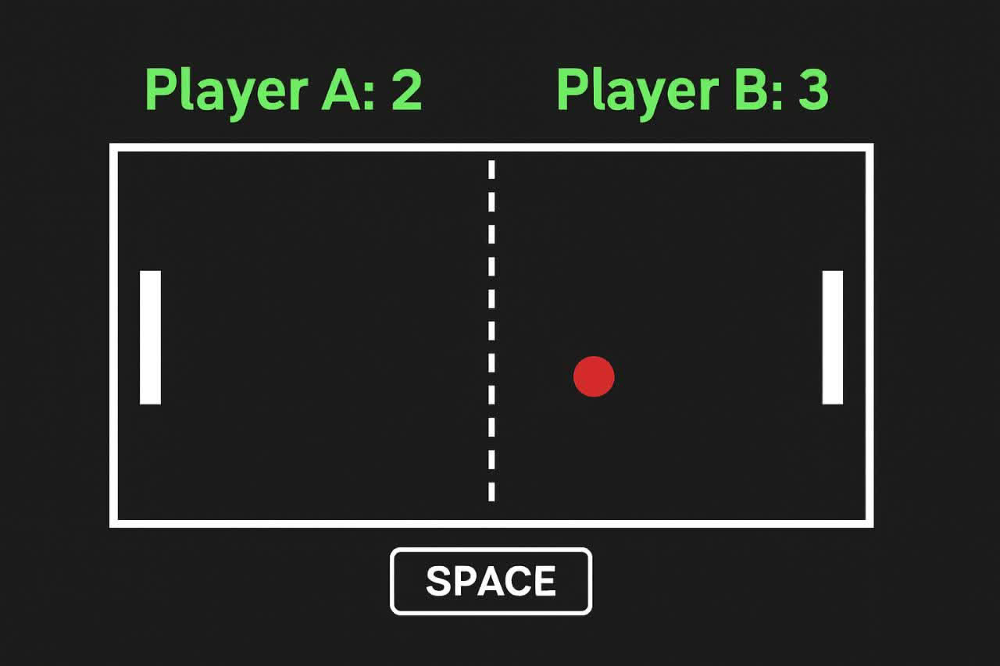

🏓 Ping Pong Game

🇬🇧 English Version

🎮 Description:
This is a simple 2-player Ping Pong game built using Python and Pygame. The game simulates the classic table tennis game where two players try to score points by hitting the ball past the opponent’s paddle. The first player to reach 5 points wins the game. 🏆

🕹️ How to Play:

Player 1 (Left Paddle) controls:

W ⬆️ Move up

S ⬇️ Move down

Player 2 (Right Paddle) controls:

UP ARROW ⬆️ Move up

DOWN ARROW ⬇️ Move down

Press SPACE ⏯️ to start the ball movement after a score.

The ball bounces off the paddles 🏓 and the top/bottom walls 🧱.

Each time the ball passes a paddle, the opposing player scores a point.

The game ends when a player reaches 5 points. 🎉

🎯 Controls Summary:

Player Move Up Move Down

Player 1 W ⬆️ S ⬇️
Player 2 ↑ ⬆️ ↓ ⬇️

---

## 🚀 How to Run
1. Make sure Python and Pygame are installed:  
   `bash
   pip install pygame

2. Run the game:

python ping-pong.py

---

🇮🇷 نسخه فارسی

🎮 توضیحات:
این یک بازی ساده ۲ نفره پینگ پنگ است که با استفاده از Python و Pygame ساخته شده است. بازی شبیه‌سازی بازی کلاسیک تنیس روی میز 🏓 است که دو بازیکن سعی می‌کنند با زدن توپ ⚽️ از کنار راکت حریف، امتیاز کسب کنند. اولین بازیکنی که به ۵ امتیاز برسد، برنده بازی 🏆 است.

🕹️ نحوه بازی:

بازیکن ۱ (راکت چپ) را با کلیدهای زیر کنترل کنید:

W ⬆️ حرکت به بالا

S ⬇️ حرکت به پایین

بازیکن ۲ (راکت راست) را با کلیدهای زیر کنترل کنید:

فلش بالا (↑) ⬆️ حرکت به بالا

فلش پایین (↓) ⬇️ حرکت به پایین

بعد از هر امتیاز برای شروع حرکت توپ، SPACE ⏯️ را فشار دهید.

توپ به دیواره‌های بالا و پایین 🧱 و راکت‌ها 🏓 برخورد می‌کند.

هر بار که توپ از کنار راکت عبور کند، بازیکن مقابل یک امتیاز می‌گیرد.

بازی زمانی به پایان می‌رسد که یک بازیکن به ۵ امتیاز برسد. 🎉

🎯 خلاصه کنترل‌ها:

بازیکن حرکت به بالا حرکت به پایین

بازیکن ۱ W ⬆️ S ⬇️
بازیکن ۲ ↑ ⬆️ ↓ ⬇️

نحوه احرا:

1. مطمئن شوید Python و Pygame نصب هستند:

pip install pygame

‍‍‍‍‍
2. اجرای بازی:

python ‍‍‍‍‍‍‍‍‍‍‍‍‍‍‍‍ping-pong.py

